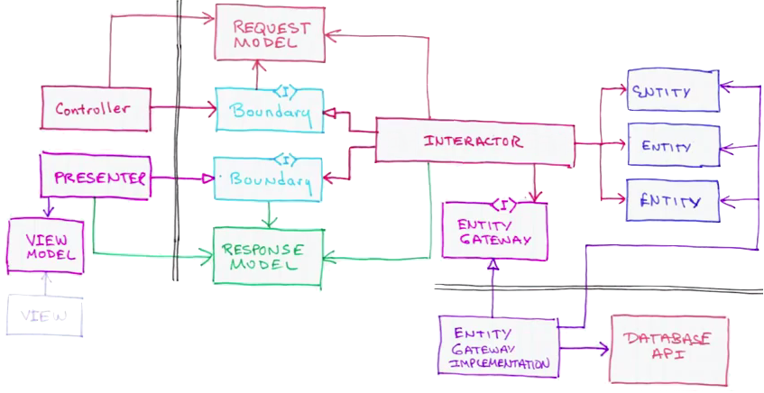

# Plugin Architecture: Model Controller Presenter

MCP, Also known as a __Plugin Architecture__.

It introduces the concept of _Architectural Boundary_ (do not confuse with Boundary object), that separates the business rules from whatever technology dependency we use.

Interactor it's going to take Response Model Data Structure, and pass it through the Boundary (and through the Architectural Boundary) to a Presenter.

## Flow

Controller passes data trough a Boundary object, and a Request Model (Input Data) Data Structure, to an Interactor.

Interactor it's going to take Response Model Data Structure, and pass it through the Boundary (and through the Architectural Boundary) to a Presenter.

## Plugins Analogy

Plugins are defenselss and vulnerable against the thing they plug into, because if it changes its interface, plugin will need to change too.

We can think of our own modules as plugins.

There are things in our system that we want to be __immune__ from other things in the system. For example, we'd want Business Rules to be immune to changes in the UI. That means, we'd like the UI to act as a plugin for the Business Rules.

__If something changes a lot, it should be a Plugin__.
