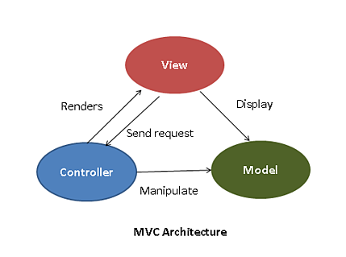

# MVC Comparison

1. Architecture
2. Data Flow Direction
3. Store
4. Business Logic
5. Debugging
6. Usage

## 1. Architecture

### MVC

MVC is well-known for its three-layer development architecture and dividing application into three components:

* __Model__: Maintains data and behavior of an application.

* __View__: Displays model in UI.

* __Controller__: Serves as an interface between View & Model components.

Whenever a controller receives a request from the user, it uses the appropriate Model & View and generates the response sending it ack to the user.

### Flux

Proposes the use of _Store/s, Actions, View & Dispatcher_.

When a user clicks on something, the View creates Actions. An Action can create new data and send it to the Dispatcher. The Dispather then broadcast the Action result to the appropriate Stores. The Stores update the state based on the result and sends an update to the View.

## 2. Data Flow Direction

> MVC-type implementation enforces bidirectional data flows, which differes from the unidirectional data flow maintained in Flux.

In MVC, different parts of the system possess the authority to change state as well as state is decentralized throughout the app. For instance, consider a large application where you have a collection of models including the user, authentication, account, etc., ant they are bundled in their own controllers and views. Here, it is difficult to track the exact location of a state since it is distributed across the application.

Flux encourage unidirectional data flow to ensure clean and predictable changes in state, having a better control over it.

## 3. Stores

Flux uses _"Stores"_ to cache data/state whereas MVC "_Model_" attempts to model a single object and doesn't have the concept of the Store.

The Store is similar to a Model in MVC, but it handles the state of several objects instead of just denoting a single database record.

## 4. Business Logic

In MVC, the Controller takes the responsibility of handling both the data and state of the application. It is responsible for the initial processing of the request, but business decisions should be done within the model.

Similarly, in Flux, the logic of changes in the data based upon the actions is mentioned in the appropriate Store. The Store in the app also possesses the flexibility to decide what parts of your data to expose publicly.

## 5. Debugging

> Bidirectional data flow between Views and Models makes it difficult to debug MVC applications.

On the other hand, Flux architecture is particularly helpful for actions that include side effects. Flux includes singleton Dispatcher and all Actions are passing through that Dispatcher. This design defends against hard-to-debug cascading updates.

## 6. Usage

MVC is popular in both server-side and client-side frameworks. AngularJS, Ember, Backbone, Sprout, and Knockout are a few frontend examples. Spring, RoR, Django, Meteor are backend examples.

Flux, in contrast, is largely a front-end pattern. Flux addresses the problems of handling application state on client-side.
