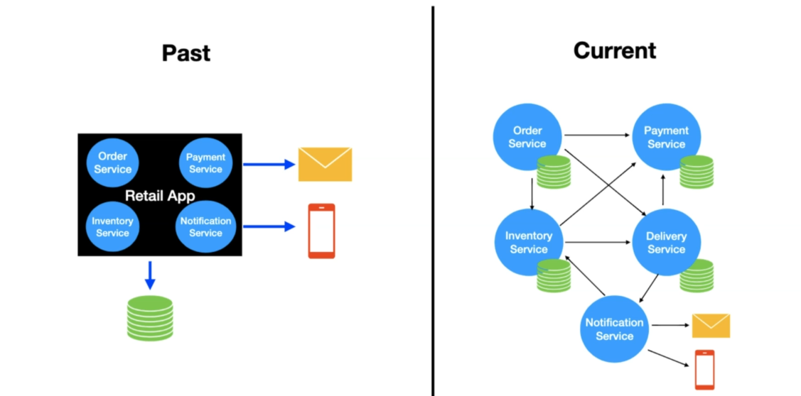
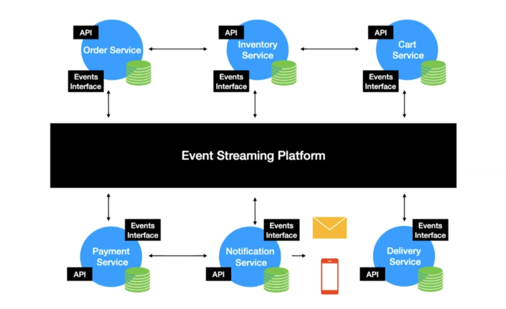

# Microservice Architecture

- [Microservice Architecture](#microservice-architecture)
  - [Overview](#overview)
  - [Service Granularity](#service-granularity)
  - [Properties](#properties)
    - [Overall Characteristics](#overall-characteristics)
    - [Martin Folwer's Properties](#martin-folwers-properties)
  - [Tradeoffs](#tradeoffs)
    - [Benefits](#benefits)
    - [Critisicsm](#critisicsm)
      - [Microservices & SOA](#microservices--soa)
    - [Distributed Services](#distributed-services)

## Overview 

Microservice architecture is a *variant of the service-oriented architecture (SOA)*, it arranges an application as a **collection of loosely-coupled services**.

> A **microservice** is not a layer within a monolithic application (i.e, web controller or backend-for-frontend). Rather **it is a self-contained piece of business functionality with clear interfaces**, and may, through its own internal components, implement a layered architecture.

Microservice architecture try to improve some of the disadvantages and restrictions of monolith applications caused by lack of modularity.

> Modularity supports reuse of parts of the application logic and also facilitates maintenance by allowing repair or replacement of parts of the application without requiring wholesale replacement.

Modularity is achieved to various extents by *different modularization approaches*. **Service-oriented architectures use specific communication standards/protocols to communicate between modules**.

Current applications usually want to provide real-time notifications, for that we need an *Event Streaming Middleware* (i.e. Apache Kafka).

## Service Granularity

A key step in defining a microservice architecture is figuring out how big an individual microservice has to be.

There is no consensus for this, as the right answer depends on the business and organizational context.

> For instance, Amazon famously uses a SOA where a service often maps 1:1 with a team of 3 to 10 engineers.

Generally, services that are dedicated to a single task, such as calling a particular backend system or making a particular type of calculation, are called as **atomic services**. Similarly, services that call such atomic services in order to consolidate an output, are called as **composite services**.

> It is considered a bad practice to make the service to small, as then the runtime overhead and the operational complexity can overwhelm the benefits of the approach. When things get too fine-grained, alternative approaches must be considered, such as packaging the function as a library, moving the function into other microservices.

If *Domain Driven Design* is employed, then a microservice could be as small as an *Aggregate* or as large as a *Bounded Context*.

## Properties

### Overall Characteristics

There is no single definition for microservices. A consensus view has evolved over time in the industry. Some of the defining characteristics that are frequently cited include:

* Services in a microservice architecture (MSA) are often processes that communicate over a network to fulfil a goal using technology-agnostic protocols such as HTTP.

* Services are organized around business capabilities.

* Services can be implemented using different programming languages, databases, hardware and software environment, depending on what fits best.

* Services are small in size, messaging-enabled, bounded by contexts, autonomously developed, independently deployable, decentralized and built and released with automated processes.

### Martin Folwer's Properties

Martin Fowler descries a microservices-based architecture as having following properties:

* Lends itself to a continuous delivery software development process. A change to a small part of the application only requires rebuilding and redeploying only one or a small number of services.

* Adheres to principles such as fine-grained interfaces (to independently deployable services), business-driven development (e.g. *domain-driven design*).

## Tradeoffs

### Benefits

* __Modularity__: Application is easier to understand, develop, test, and become more resilient to architecture erosion. This benefit is often argued in comparision to the complexity of monolithic architectures.

* __Scalability__: Since microservices are implemented and deployed independently of each other, i.e. they run within independent processes, they can be monitored and scaled independently.

* __Integration of heterogeneous and legacy systems__: Microservices is considered as a viable means for modernizing existing monolithic applications, by replacing parts of the existing software using an *incremental approach*.

* __Distributed development__: It parallelizes development by enabling small autonomous teams to develop, deploy and scale their respective services independently. It facilitates *continuous integratio, delivery and deployment*.

### Critisicsm

#### Microservices & SOA

Microservices as a way of applying a *Service Oriented Architecture* comes with some concerns:

* Viewing the size of services as the the primary structuring mechanism can lead to too many services when the alternative of **internal modularization may lead to a simpler design**.

* There is **no sound definition** of when a service starts or stops being a microservice.

### Distributed Services

Microservices come associated with most of the general drawbacks of any distributed service:

* Network latency
* Message format design
* *BAC*: Backup, Availability & Consistency
* Load balancing
* Fault tolerance

> Two-phased commits are regarded as an anti-pattern in microservices-based architectures as this results in a tighter coupling of all the participants within the transaction. However, lack of this technology causes **awkward orchestation** that has to be implemneted by all the transaction participants **in order to maintain data consistency**.

Having to deal with all those concerns at scale increase the **architectural complexity** of the whole system.

> Some of the complexity from the monolith application gets translated into operational complexity.
