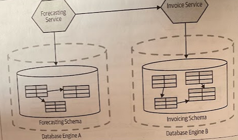

# Splitting Apart the Database

- [Splitting Apart the Database](#splitting-apart-the-database)
  - [Physical vs Logical Separation](#physical-vs-logical-separation)
  - [Splitting the Database First, or the Code?](#splitting-the-database-first-or-the-code)
    - [Split the Database First](#split-the-database-first)

## Physical vs Logical Separation

We need to find seams in our databases too so we can split them out cleanly. Databases, however, are tricky beats. We need to understand how logical separation and physical deployment may be related.

*Logical decomposition* allows for simpler independent change and information hiding, whereas *physical decomposition* potentially improves system robustness, and could help remove resource contention allowing for improved throughput or latency.

Having multiple schemas sharing the same database engine may be required if you want to expose views of your database. Also, it may be hard to justify having multiple database clusters because of the time, effort, and cost that may be involved.

## Splitting the Database First, or the Code?

Extracting a microservice isn't "done" until the application code is running in its own service, and the datta it controls is extracted into its own logically isolated database. We have a few options:

* Split the database first, then the code.
* Split the code first, then the database.
* Split them both at once.

### Split the Database First

With a separate schema, we'll be *potentially increasing the number of database calls* to perform a single action. Now we may need to pull the data back from two locations and join in memory. Also, we end up *breaking transactional integrity* when we move to two schemas.

By splitting the schemas out but keeping the application code together, we give ourselves the *ability to revert our changes or continue* to tweak things without impacting any consumers of our service if we realize we're heading dow nthe wrong path.

Once we are satisfied that the DB separation makes sense, we could then think about splitting out the application code into two services.

The flip side is that this approach is unlikely to yield much short-term benefit. We still have a monolithic code deployment. Arguably, the pain of a shared database is something you feel over time, so we're spending time and effort now to give us return in the long run, without getting enough of the short-term benefit.

We can go this route if we are *specially concerned* about the potential performance or data consistency issues.
