# Pattern: Strangler Fig Application

- [Pattern: Strangler Fig Application](#pattern-strangler-fig-application)
  - [Overview](#overview)
  - [How It Works](#how-it-works)
  - [Where To Use It](#where-to-use-it)
  - [Proxy Options](#proxy-options)
    - [Example: HTTP Proxy](#example-http-proxy)
    - [Redirection by Resources](#redirection-by-resources)
    - [Incremental Rollout](#incremental-rollout)
    - [Changing Protocols](#changing-protocols)
    - [Service Meshes](#service-meshes)
    - [Content-based Routing](#content-based-routing)
    - [Selective Consumption](#selective-consumption)
  - [Changing Behavior While Migrating Functionality](#changing-behavior-while-migrating-functionality)

## Overview

> Martin Fowler first captured this pattern, inspired by a certain type of fig that seeds itself in the upper branches of trees. The fig then descends toward the ground to take root, gradually enveloping the original tree. The existing tree becomes intially a support structure for the new fig, and if taken to the final stages, you may see the original tree die and rot away, leaving only the new, now self-supporting fig in its place.

Have our new system initially be supported by, and wrapping, the existing system. The idea is that the old and the new can coexist, giving the new system time to grow and potentially entirely replace the old system. This allows for **incremental migration**.

Moreover, it gives us the ability to pause and even stop the migration altogether, while still taking advantage of the new system delivered so far.

We strive to not only take incremental steps toward our new application architecture, but also **ensure that each step is easily reversible**, reducing the risk of each incremental step.

## How It Works

This may involve actually copying the code from the monolith (if possible), or else reimplementing the functionality in question.

If the functionality in question requires the persistence of state, then consideration needs to be given to how the state can be migrated to the new service, and potentially back again.

1. Identify the parts of the existing system that you wish to migrate.
2. Implement this functionality in your new microservice.
3. Reroute calls from the monolith to the new microservice.

The new functionality isn't technically live until the call to the moved functionality is redirected, even if it is deployed into a production enviornment.

> Separating the concepts of *deployment* from *release* is important. The deployment of software into a given environment doesn't mean that it's actually being used by customers. This way you enable the ability to validate your software in the final production environment before it is being used, allowing you to de-risk the rollout of the new software.

A key point of this strangler fig application is that we can also **roll back this chance very easily if required**.

## Where To Use It

* Move functionality without having to touch or make any changes to your existing system.
* Monolith is being worked on by other people.
* Monolith is a black-box system.

In order to perform a clean end-to-end extraction like this, you might be inclined to extract larger groups of functionality to simplify this process. This can result in a tricky balancing act, by extracting larger slices of functionality, you are taking on more work, but may simplify some of your integration challenges.

If you do want to take a smaller bite, you may have to consider more "shallow" extractions, even if it makes use of other functionality that remains inside the monolith

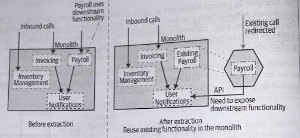

We'd ideally like to move out the ability to send *User Notifications* to our customers into a new service. However, notifications are fired as a result of multiple inbound calls to the existing monolith. Therefore, we can't clearly redirect the calls from outside the system itself. **The strangler fig pattern doesn't work too weel when the functionality to be moved is deeper inside the existing system.**

## Proxy Options

### Example: HTTP Proxy

A simple overview of an HTTP-driven monolith prior to a *strangler* being implemented.

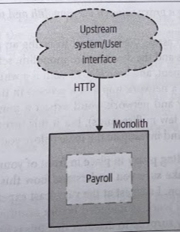

1. **Insert proxy** that will just allow any calls to pass through without change.

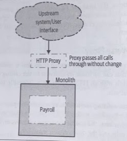

2. **Migrate functionality**. This step can be broken into multiple stages. First, get a basic service up and running without any of the functionality being implemented. Your service will need to accept the calls made to the matching functionality, but at this stage you could just return a `501 Not implemented`.

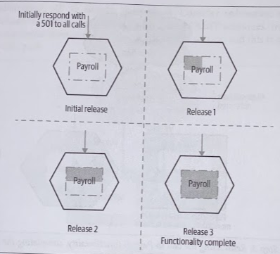

3. **Redirect calls**. Once you've completed movement of all the functionality, you reconfigure the proxy to redirect the call. If this fails for whatever reason, then you can switch the redirection back. You may decide to implement redirection other techniques such as a *feature toggle*, a *canary rollout*, or even a full-blown *parallel run*.

### Redirection by Resources

Some redirections will be simpler than others. Consider redirections around URI paths, perhaps as would be exhibited making use of REST resources.

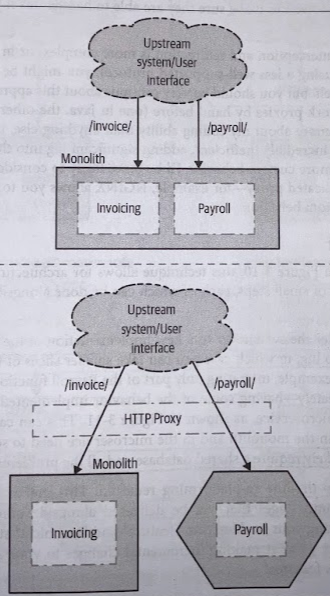

### Incremental Rollout

You might consider the switchover to a new implementation of the Payroll functionality to still be too big, in which case you can **take smaller slices of functionality**. This can cause issues if both the functionality in the monolith and in the microservice need to see the same set of data, as this will likely require a shared database and all the problems this can bring.

**No big bang stop-the-line re-platforming required**. This makes it much easier to break this work into stages that can be delivered alongside other delivery work.

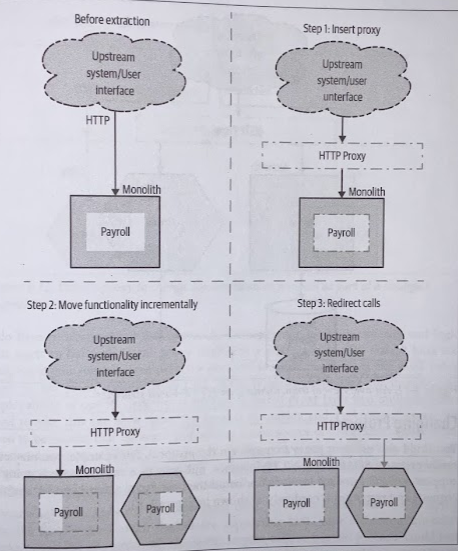

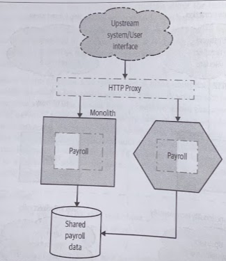

### Changing Protocols

You could also use your proxy to transform the protocol.

> For example, you may currently expose a SOAP-based HTTP interface, but your new microservice is going to support as gRPC interface instead.

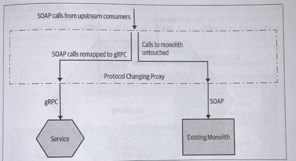

Complexity and logic starts to build up in the proxy itself. For a single service, this doesn't look to bad, but if you start transforming the protocol for multiple services, the work being done in the proxy builds up and up.

We're typically optimizing for independent deployability of our services, but if we have a shared proxy layer that multiple teams need to edit, this can slow down the process of making and deploying changes.

> "Keep the pipes dumb, the endpoints smart."

We want to reduce howhow much functionality gets pushed into shared middleware layers.

If you want to migrate the protocol being used, I'd much rather push the mappingi nto the service itself, with the service supporting both the old and new protocols. Inside the service, calls to our old protocol could just get remapped internally to the new communication protocol. This avoids the need to manage changes in shared proxy layers and **puts the service in full control** over how this functionality changes over time.

You might expose the same functionality in different ways to different consumers; by supporting different message or request formats inside this service.

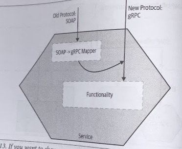

### Service Meshes

> "The Road to an Envoy Service Mesh" by Snow Pettersen at Square's developer blog.

With a *service mesh*, each service instance communicates with other service instances via its own, dedicated local proxy. **There is no central proxy layer**, you avoid the pitfalls regarding having a shared "smart" pipe. Each service can own its own piece of the service-to-service pipe if needed.

### Content-based Routing

Intercept *all* messages intended for the downstream monolith, and filter the messages on to the appropriate location.

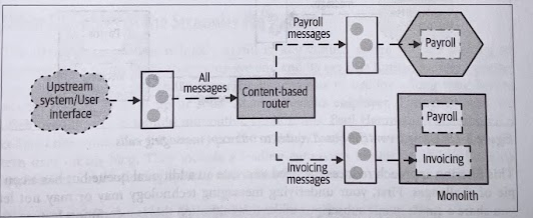

This technique allows us to leave the monolith untouched but we're placing another queue on our request path.

> It's arguable that the content-based router is implementing a "smart pipe", adding complexity in terms of how calls are routed between our systems. In some situations, this is a highly useful technique.

### Selective Consumption

Change the monolith and have it ignore messages sent which should be received by our new service. Here, we have both our new service and our monolith share the same queue, and locally they use some sort of *pattern matching* process to listen to the messages they care about.

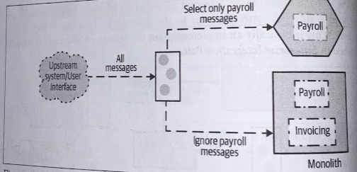

When you want to redirect the calls, **it requires two changes to be fairly well coordinated**. You need to stop your monolith from reading the calls meant for the new service, and then have the service pick them up. Likewise, reverting the call interception requires two changes to roll back.

Consider using selective consumption with only a small number of consumers and/or with a simple set of filtering rules.

## Changing Behavior While Migrating Functionality

If the Payroll microservice had a few bug fixes applied to how it works that hadn't been back-ported to the equivalent functionality in the monolith, then a rollback would also cause those bugs to reappear in the system. This can get more problematic if you'd added new functionality to the Payroll microservice.

If you allow for changes in functionality you are moving before the migration is complete, then you have to accept that you are making any rollback harder.

It's easier if you don't allow for any changes until the migration is complete. The longer the migration takes, the harder it can be to enforce a *feature freeze* in this part of the system.

> The longer it takes you to complete the migration, the more pressure you'll be under to "just flip this feature while you're at a it".

The smaller you make each migration, the less pressuire you'll be under to change the functionality being migrated before the migration has completed.
