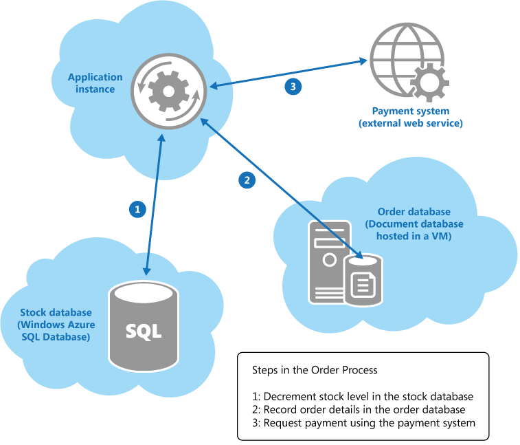

# Eventual Consistency

- [Eventual Consistency](#eventual-consistency)
  - [Overview](#overview)
  - [CAP Theorem](#cap-theorem)
  - [Caching](#caching)
  - [Implementation considerations](#implementation-considerations)

## Overview

Data update operations that span multiple sites can ripple through the various data stores in their own time, without blocking concurrent application instances that access the same data.

Traditional DB management systems focus on providing strong consistency, whereas cloud-based solutions that utilize partitioned data stores are typically motivated by ensuring higher availability, and are therefore more oriented towards eventual consistency.

It is worth bearing in mind that an application may not actually require data to be consistent all of the time.

> For example, in a typical ecommerce web application, any stock levels presented to a user are likely to be static values determined when the details for a stock item are queried. If another concurrent user purchases the same item, the stock level in the system will decrease but this change will probably not need to be reflected in the data displayed to the first user. If the stock level drops to zero and the first user attempts to purchase the item, the system could either alert the user that the item is now out of stock, or place the item on back order and inform the user that the delivery time may be extended.

## CAP Theorem

One of the drives for eventual consistency is that distributed data stores are subject to the _CAP Theorem_, which states that a distributed system can implement only two of the three features (i.e., Consistency, Availability, and Partition Tolerance) at any one time.

This means that you can either:

- Provide a consistent view of distributed (_partitioned_) data the cost of blocking access to that data while any inconsistencies are resolved. This may take an indeterminate time, especially in systems that exhibit a high degree of latency or if a network failure occurs.
- Provide immediate access to the data at the risk of it being inconsistent across instances.

## Caching

If the data stored changes, all copies cached by applications will be most likely out of date. Configuring a _cache expiration policy_ that prevents cached data from becoming too stale, and implementing techniques such as the [_cache-aside_ pattern](https://docs.microsoft.com/en-us/previous-versions/msp-n-p/dn589799(v=pandp.10)) can help to reduce the chances of inconsistencies.

However, these approaches are unlikely to completely eliminate inconsistencies in cached data, and it is important that applications that use caching as an optimization strategy can handle these inconsistencies.

## Implementation considerations

There are many issues that you must consider if you want to follow this eventual consistency model.

Consider the following example, a simple ecommerce application that could benefit from following the eventual consistency approach.

> A distributed transaction spanning three heterogeneous data sources.

When a customer places an order, the application instance performs the following operation across a collection of heterogeneous data stores held in various locations:

1. Update the stock level of the item ordered.
2. Record the details of the order.
3. Verify payment details for the order.

Although these operations comprise a _logical transaction_, attempting to implement strong transactional consistency in this scenario is likely to be impractical. Instead, implementing the order process as an eventually consistent series of steps, where each step in the process is essentially an autonomous operation, is a much more scalable solution.

While these steps are progressing, the state of the overall system is inconsistent.

> For example, after the stock level has been updated but before the details of the order have been recorded, the system has temporarily _lost_ some stock. However, when all the steps have been completed, the system returns to a consistent state and all stock items can be accounted for.

Despite the fact that implementing eventual consistency in this example appears to be conceptually quite simple, __the developer must ensure that the system does eventually become consistent__. In other words, __the application is responsible__ for guaranteeing either that all three steps in the order process complete, or determining the actions to take if any of the steps fail.
