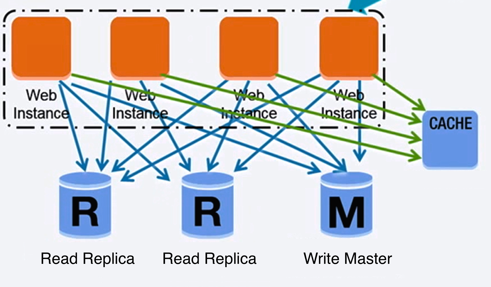

# Replication

Replication involves **sharing information** so as to **ensure consistency between redundant resources**, to improve **reliability**, **fault-tolerance**, or **availability**. It can also provide better performance (e.g., allowing parallel queries).

> It's usually used with a master/slave strategy: master generally only supports writes, slaves generally only support reads.

Replication is one of the many techniques to **scale a database**. Database replication becomes more complex when it scales-up horizontally and vertically. Horizontal scale-up has more data replicas while vertical scale-up has data replicas located at greater physical distances.

> Problems raised by horizontal scale-up can be alleviated by a multi-layer, multi-view access protocol. The early problems of vertical scale-up have largely been addressed by improving Internet reliability and performance.

## Disadvantages

Replication presents some **disadvantages**:

* There is a potential for loss of data if a *master* fails before any newly written data can be replicated to other nodes.

* Writes are replayed to the read replicas. If there are a lot of writes, the read replicas can get bogged down with replaying writes and can't do as many reads.

* The more read *slaves*, the more you have to replicate, which leads to greater replication lag.

* On some systems, writing to the *master* can spawn multiple thread to write in parallel, whereas read replicas only support writting with a single thread.

* Replication adds more hardware and additonal complexity.

## Strategies

### Master-Slave

The *master* serves reads and writes, replicating writes to one or more *slaves*, which serve only reads. *Slaves* can also replicate to additional slaves in a tree-like fashion.

If the *master* goes offline, the system can continue to operate in read-only mode until a *slave* is promoted to a *master* or a new *master* is provisioned.

The **disadvantage** of *Master-Slave* is that it requires logic is needed to promote a *slave* to a *master*.

### Master-Master

Both *masters* serve reads and writes and coordinate with each other on writes. if either *master* goes down, the system can continue to operate with both reads and writes.

The **disadvantages** with *Master-Master* are:

* You'll need a *load balancer* or to make changes to your application logic to determine where to write.

* Most *master-master* systems are either loosely consistent (violating ACID) or have increased write latency due to synchronization.

* Conflict resolution comes more into play as more write nodes are added and as latency increases.

### Multi-Master

Updates can be submitted to any database node, and then ripple through to other servers.

> This introduces substantially increased costs and complexity which may make it impractical in some situations.

The most common challenge is **transactional conflict prevention** or **resolution**. Most *synchronous* (**eager**) replication solutions perform conflict prevention, while *asynchronous* (**lazy**) solutons have to perform conflict resolution. The resolution of such a conflict may be based on a timestamp of the transaction, on the hierarchy of the origin nodes, or on so much more complex logic, which decides consistently across all nodes.

> For instance, if the same record is changed on two nodes simultaneously, an *eager replication* system would detect the conflict before confirming the commit and abort one of the transactions. A *lazy replication* system would allow both transactions to commit and run a conflict resolution during re-synchronization.
