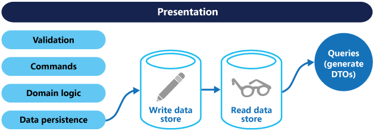

# CQRS: Command and Query Responsibility Segregation

> CQRS is a pattern that separates read and update operations for a data store. It allows a system to better evolve over time and prevents update commands from causing merge conflicts at the domain level.

- [CQRS: Command and Query Responsibility Segregation](#cqrs-command-and-query-responsibility-segregation)
  - [Context and problem](#context-and-problem)
  - [Solution](#solution)
  - [Advantages](#advantages)
  - [Disadvantages](#disadvantages)
  - [Implementation details](#implementation-details)
    - [Separate data stores](#separate-data-stores)

## Context and problem

In traditional architectures, the same data model is used to query and update a database. That's simple and works well for basic CRUD operations.

However, as the system evolves, the data model and the queries become more complex. On the read side, the application may perform many different queries, returning DTOs with different shapes. On the write side, the model may implement complex validation and business logic.

- There is often a _mismatch_ between the read and write representations of data, such as additional columns or properties that must be updated correctly even though they aren't required as part of an operation.
- _Data contention_ can occur when operations are performed in parallel on the same set of data.
- _Performance_ can be affected due to load on the data store and data access layer, and the _complexity_ of the queries requried to retrieve information.
- Managing _security_ and permissions can become complex, because each entity is subject to both read and write operations, which might expose data in the wrong context.

## Solution

CQRS separates reads and writes into different models, using __commands__ to update data, and __queries__ to read data.o

- Commands should be task-based, rather than data centric. (e.g. "Book hotel room", not "set ReservationStatus to Reserved").
- Commands may be placed on a queue for asynchronous processing, rather than being processed synchronously.
- Queries never modify the database. A query returns a DTO that does not encapsulate any domain knowledge.

> The models can then be isolated, although that's not an absolute requirement.

## Advantages

## Disadvantages

- **Complexity**: CQRS code can't automatically be generated from a database schema using caffolding mechanisms such as ORM tools. It can lead to more complex design and implementation, especially if they include the _Event Sourcing_ pattern.

## Implementation details

### Separate data stores

For greater isolation, you can physically separate the read data from the write data. In that case, the read database can use its own data schema that is optimized for queries.

For example, it can store a _materialized view_ of the data, in order to avoid complex joins or complex ORM mappings. It might even use a different type of data store. For example, the write database might be relational, while the read database is a document database.

If separate read and write databases are used, __they must be kept in sync__. Typically this is accomplished by having the write model publish an event whenever it updates the database. This __must occur in a single transaction__.

> See [Event-driven architecture style](https://docs.microsoft.com/en-us/azure/architecture/guide/architecture-styles/event-driven).

