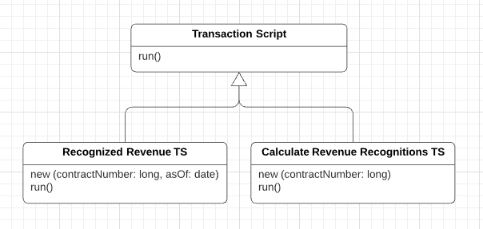

# Transaction Script

> *"Organizes business logic by procedures where each procedure handles a single request from the presentation."* - Martin Fowler

## Overview

Most business applications can be though of as a series of transactions. A transaction may view some information as organized in a particular way, another will make changes to it.

Each interaction between a client system and a server system contains a certain amount of logic. In some cases this can be as simple as displaying information in the database. In others it may involve many steps of validations and calculations.

A **Transaction Script** organizes all this logic primarily as a single procedure, making calls directly to the database or through a thin database wrapper.

Each transaction will have its own *Transaction Script*, although common subtrasks can be broken into subprocedures.

## How It Works

With *Transaction Script* the domain logic is primarily organized by the transactions you carry out with the sstem.

> If your need is to book a hotel room, the logic to check room availability, calculate rates, and update the database is found inside the *Book Hotel Room procedure*.

One of the benefits of this approach is that you don't need to worry about what other transactions are doing. Your task is to get the input, interrogate the database, munge, and save your results to the database.

Where you put the *Transaction Script* will depend on how you organize your layers.

The most common is to have several *Transaction Scripts* in a **single class**, where each class defines a subject area of related *Transaction Scripts*.

The other way is to have each one in its own class, using the *Command patter* (Gang of Four). In this case you define a supertype for your commands that specifies some `execute` method in which *Transaction Script* logic fits.

> *"I use the term *Transaction Script* because most of the time you'll have one *Transaction Script* for each database transaction."* - Martin Fowler

In addition, don't have any calls from the *Transaction Scripts* to any presentation logic; that will make it easier to modify the code and test the *Transaction Scripts*.

## When to Use It

Organizing logic this way is natural for applications with only a **small amount of logic**, and it involves very little overhead either in performance or in understanding.

As the business logic gets more complicated, however, it gets progressively harder to keep it in a well-designed state.

One particular problem to watch for is its duplication between transactions. Careful factoring can alleviate many of these problems, but more complex business domains need to build a *Domain Model*. It's possible to refactor a *Transaction Script* design to a *Domain Model* design, but it's a harder change than it otherwise needs to be.

## Case Study: The Revenue Recognition Problem

> [The Revenue Recognition Problem](../../../problems/revenue-recognition)

### Java Example

