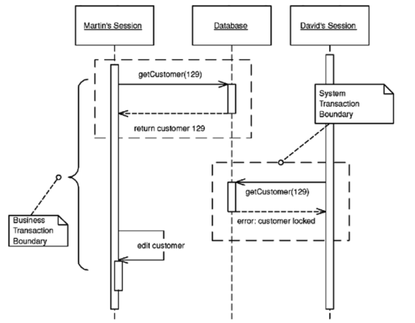

# Pessimistic Offline Lock

> Prevents conflicts between concurrency business transactions by allowing only one business transaction at a time to access data.

* Overview
* How It Works
  * Lock Types
* When to Use It

## Overview

*Pessimistic Offline Lock* **prevents conflicts by avoiding them altogether**. It forces a business transaction to acquire a lock on a piece of data before it starts to use it, so that, most of the time, once you begin a business transaction you can be pretty sure you'll complete it without being bounced by concurrency control.

## How It Works

* It can be implemented in three phases:

  1. Determining what *lock types* you need.
  2. Building a *lock manager* (a table that maps locks to owners).
  3. Defining procedures for a business transaction to use locks.

* If you are using *Pessimistic Offline Lock* as a complement to *Optimistic Offlien Lock* you need to determine which record types to lock.

### Lock Types

> In choosing the correct lock type think about maximizing system concurrency, meeting business needs, and minimizing code complexity. Also keep in mind that the locking strategy must be understood by domain modelers and analysts.

* **Exclusive Write Lock**: Requires only that a business transaction **acquires a lock in order to edit session data**. This avoids conflict by not allowing two business transactions to make changes to the same record simultaneously. This locking scheme ignores the reading of data, so it's used when it's not critical that a view session have the most recent data.

* **Exclusive Read Lock**: Requires that a business transaction **acquires a lock simply to load the record**. It is used when it becomes critical that a business transaction always has the most recent data, regardless of its intention to edit.

* **Read/Write Lock**: Combines the two lock types to provide the restrictive locking of the *Exclusive Read Lock* as well as the increased concurrency of the *Exclusive Write Lock*.
  * Read and write locks are **mutually exclusive**. A record can't be write-locked if any other business transaction owns a read lock on it; it can't be read-locked if any other business transaction owns a write lock on it.
  * **Concurrent read locks are acceptable**.

## When to Use It

* It is appropriate when **the chance of conflict between concurrent sessions is high**. A user should never have to throw away work.

* It is also appropriate when **the cost of a conflict is too high regardless of its likelihood**.

* You should only use *Pessimistic Offline Lock* when it's truly required and as complementary to *Optimistic Offline Lock*.

* If you have to use *Pessimistic Offline Lock*, you should also consider a long transaction.
