# Model View Controller

> This notes are based on [Martin Fowler's post](https://www.martinfowler.com/eaaDev/uiArchs.html) and his book *Patterns of Enterprise Application Architecture*.

- [Model View Controller](#model-view-controller)
  - [Overview](#overview)
  - [How It Works](#how-it-works)
    - [Observer Pattern](#observer-pattern)
    - [Reflective Invocation & Data Binding](#reflective-invocation--data-binding)
    - [Observer Synchronization](#observer-synchronization)
    - [Unidirectional Data Flow / One-way Data Binding](#unidirectional-data-flow--one-way-data-binding)
      - [Facebook MVC/Flux](#facebook-mvcflux)
  - [Architectural Benefits](#architectural-benefits)
    - [Models enable Encapsulation - Separation of Presentation from Model](#models-enable-encapsulation---separation-of-presentation-from-model)
    - [Models enable Persistence](#models-enable-persistence)
    - [Models enable Sharing](#models-enable-sharing)
    - [Separation of View and Controller](#separation-of-view-and-controller)
  - [Three Data Managment Questions](#three-data-managment-questions)
  - [When to Use It](#when-to-use-it)

## Overview 

> Splits user interface interaction into three distinct roles. It decouples objects so that changes to one can affect any number of others without requiring the changed object to know details of the others. Particularly, allow for multiple representations by decoupling views from application logic.

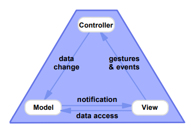

*Model View Controller* started as a framework developed by *Trygve Reensaukg* for the *Smalltalk* platform in the late 1970s. Since then it has played an influential role in most UI frameworks and in the thinking about UI design.

> The best available reference is *Pattern-Oriented Software Architecture* series of books.

At the heart of MVC, we find the idea of **separated presentation** that defines a clear division between *domain objects* that model our perception of the real world and *presentation objects* that are GUI elements. Domain objects should be completely *self contained* and work without references to the presentation, they should also be able to support multiple presentations, possible simultaneously.

> In MVC, the *domain element* is referred to as the *model*. Model objects are ignorant of the UI.

The **presentation** part of MVC is made of the two remaining elements: *view* and *controller*. The *controller*'s job is to take the user's input and figure out what to do with it.

## How It Works

* MVC Architectural Components
  * The **model** is an object that represents some information about the domain, containing all the data and behavior other than the used for the UI.

  * (*Presentation*) The **view** represents the dispaly of the *model* in the UI. It is only about display of information; any changes to the information are handled by the **controller**.

  * (*Presentation*) The **controller** takes user input, manipulates the *model*, and causes the *view* to update appropriately.

* Make a strong separation between *presentation* (view & controller) and *domain* model.

* Divide GUI widgets into a controller (for reacting to user input) and view (for displaying the state of the model).

* Controller and view should not communicate directly but through the model.

* Have views (not controllers!) observe the model to allow multiple widgets to update without needed to communicate directly.

### Observer Pattern

Like later environments, Smalltalk figured out that you wanted *generic UI components that could be reused*. In this case the component would be the *view-controller pair*. Both were generic classes, so needed to be plugged into the application specific behavior. So the first part of reacting to the user's input is the various controllers collaborating to see who got edited.

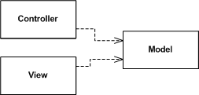

> With a rich-client interface of multiple windows it's likely that there will be **several presentations of a model on a screen at once**. If a user makes a change to the model from one presentation, the others need to change as well. To do this without creating a dependency you usually need an implementation of the *Observer* pattern (Gang of Four), such as *event propagation* or a *listener*.

The *view* acts as the *observer* of the *model*: **wherever the model changes it sends out an event and the presentation refresh the information**.

### Reflective Invocation & Data Binding

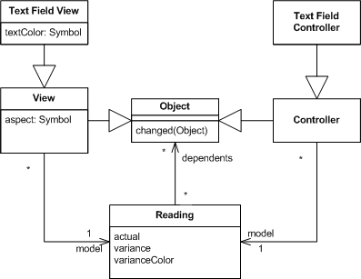

The configuration of the `Text Field` comes from giving it a link to its *model*, the `Reading`, and telling it what method to invoke when the text changes. The *controller* then makes a *reflective invocation* of that method on the *model* to make the change.

Essentially **this is the same mechanism as occurs for _Data Binding_**, the control (i.e., the view element) is linked to the underlying model object (i.e., row), and told which method it manipulates (i.e., column).

So there is no overall object observing low level widgets, instead the **low level widgets observe the model**, which itself handles many of the decision that otherwise would be made by the view (e.g., a form).

In this case, **all the views observe the model**. When the model changes, the views react. In the previous example, the actual Text Field View is notified that the Reading Object (i.e., the model), and invokes the method defined as the aspect for that text field (in this case `#actual`) and sets its value to the result.

### Observer Synchronization

The controller didn't set the value in the view itself, it updated the model and then just relies on the *observer* relationship to update the respective views.

One of the consequences of *Observer Synchronization* is that the **controller is very ignorant of what other widgets need to change** when the user manipulates a particular widget, so you have no way to make sure the overall scren state is *consistent* on a change.

Observer Synchronization has a downside, the core problem of the *observer* pattern itself: **you can't tell what is happening by reading the code**.

### Unidirectional Data Flow / One-way Data Binding

> See Stackoverflow discussion: [MVC vs. Flux ? Bidirectional vs. Unidirectional?](https://stackoverflow.com/a/34883399)

Some people misquote MVC to have a *bi-directional data flow* or *two-way data binding*; they confuse the Controller with a *broker* between View and Model. The flow of data would look something like this:

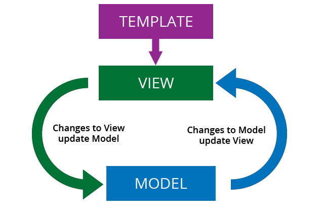

For example, if we were using Javascript:

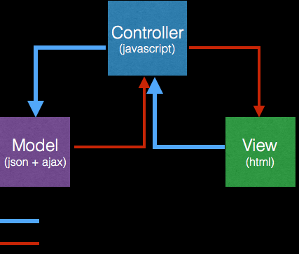

> On the front end, data flows from the view to server through the controller due to user interactions (e.g., a button click). Similarly data flows back to the view from the server, through the controller.

Even more, with some technologies, like AngularJS, we can leverage two-way data binding out of the box.

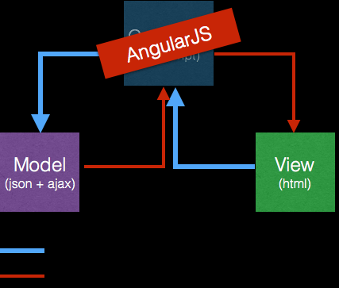

With this type of architecture, it's hard to tell which parts of our view might change after we update a model. Furthermore, we should carefully avoid cycles where a change to a view, changes the model, which updates the view, which updates the model, and so on... **This is not MVC**.

With MVC, we decouple the view from the model using the *Observer* pattern, and if we carefully avoid updating the controller from a model, or updating a view from a controller, we would have a **unidirectional data flow**.

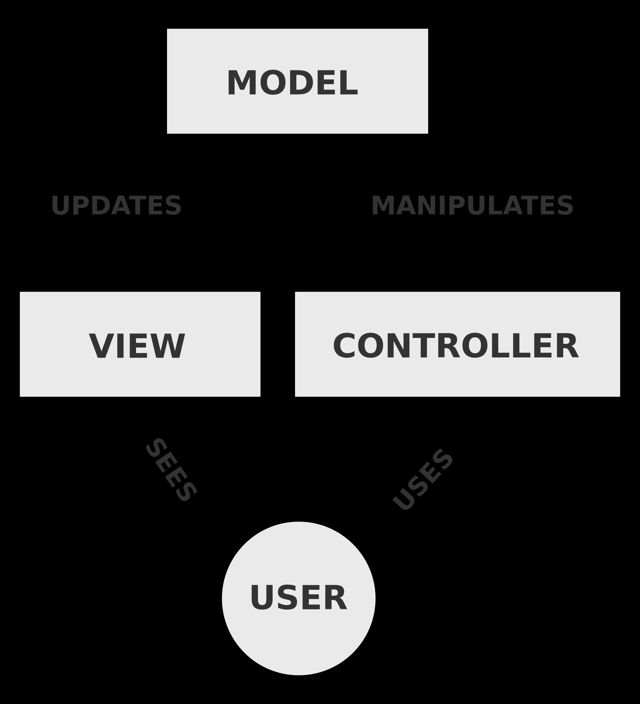

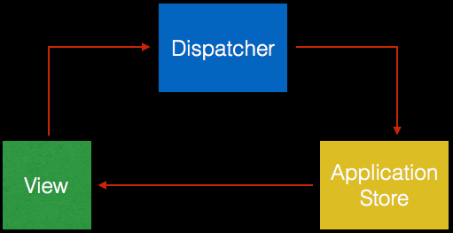

> If we introduce bi-directional communication / two-way data binding either between the view and the controller, or the controller and the model, then **we would not be talking about pure MVC anymore**.

Since the flow of data is unidirectional, there is only one way through which view can be updated. As a result this gives us a high degree of confidence that our view is a function of data and hence is deterministic.

> You can see an example of bidirectional communication in [Angular's Two Way Binding](https://angular.io/guide/two-way-binding), which leverages both *property binding* and *event binding* to communicate data between parent and child components.

#### Facebook MVC/Flux

> See Stackoverflow discussion: [MVC vs. Flux ? Bidirectional vs. Unidirectional?](https://stackoverflow.com/a/46956018).

The article [Facebook: MVC does not scale, use flux instead](https://www.infoq.com/news/2014/05/facebook-mvc-flux/) introduced a lot of controversy into this topic. Take some comments from the [Youtube Video](https://www.youtube.com/watch?v=nYkdrAPrdcw&lc=z12dx1whrx31fhokf23ntvxiayqhxf20h).

> The core problem is that they were "doing" MVC wrong. Then they fixed it, but decided to rebrand it and say they'd invented the pattern of decoupling data, view, and event handling.

> Looks like your programmers created flux because they didn't know how to properly use MVC and event dispatchers.

## Architectural Benefits

### Models enable Encapsulation - Separation of Presentation from Model

This is one of the most fundamental heuristics of good software design for several reasons:

* *Presentation* and *Model* are about different concerns.
  * *Presentation* is about the mechanisms of UI and how to lay out a good user interface.
  * *Model* is about business policies, perhaps database interactions.

* Depending on context, users want to see the same basic *model* information in different ways. Separating *presentation* and *view* allows you to develop multiple presentations and yet use the same *model* code.

* Non-visual objects are usually easier to test than visual ones. This allows you to test all the domain logic easily.

* *Model* code should be entirely unaware of what *presentation* is being used, which both simplifies their tasks and makes it easier to add new *presentations* latter on. It also menas that *presentation* changes can be made freely without altering the model.

* Over time I'm *able to change the underlying data structures in my model*, and still reuse the same presentation code without modification.

### Models enable Persistence

How the model actually stores its data is up to the model. This can be achieved *transparently* to the presentation and can be changed over time or for different installations.

* The model could implement:
  * Access control and authentication
  * Accounting
  * Cache
  * Databases from different vendors 

### Models enable Sharing

Abstracting out the model also permits greater flexibility of use among multiple users. Having different program models encapsulate the same remote data allows multiple users to share the same data and collaborate simulatenously.

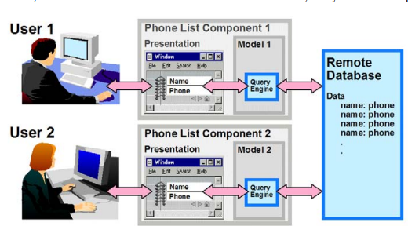

### Separation of View and Controller

> In practice most systems have only one controller per view, so this separation is usually not done. This has led to many misquotations of MVC. The common misconception is that the *controller* sits between the *model* and the *view*, as in the *Application Controller*, but whatever the merits of a *Application Controller*, it's a very different beast from an MVC controller.

Support **editable and noneditable behavior** (e.g. which you can do with one view and two controllers). The controllers act as *Strategies* (Gang of Four) for the *views*.

## Three Data Managment Questions

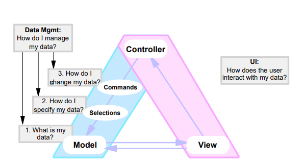

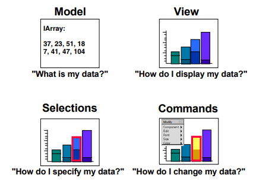

## When to Use It

__The separation of *presentation* and *model*__ is one of the most important design principles in software, and the only time you shouldn't follow it is in very simple systems where the model has no real behavior in it anyway. **As soon as you get some nonvisual logic you should apply the separation**.

__The separation of *view* and *controller*__ is less important, you should evaluate when it's helpful. For rich-client systems, that ends up being hardly ever.
