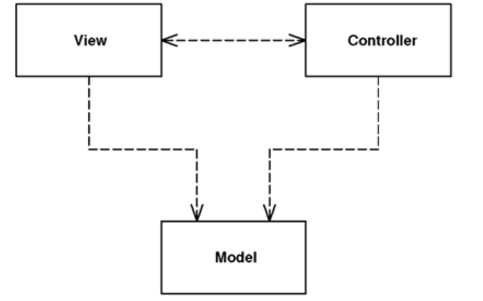

# Model View Controller

> Splits user interface interaction into three distinct roles. It decouples objects so that changes to one can affect any number of others without requiring the changed object to know details of the others. Particularly, allow for multiple representations by decoupling views from application logic.

* Overview
* How It Works
  * Separation of Presentation from Model
    * Common Issue
  * Separation of View and Controller
* When to Use It

## Overview 

*Model View Controller* started as a framework developed by *Trygve Reensaukg* for the *Smalltalk* platform in the late 1970s. Since then it has played an influential role in most UI frameworks and in the thinking about UI design.

> The best available reference is *Pattern-Oriented Software Architecture* series of books.

## How It Works

* The **model** is an object that represents some information about the domain, containing all the data and behavior other than the used for the UI.

* The **view** represents the dispaly of the *model* in the UI. It is only about display of information; any changes to the information are handled by the **controller**.

* The **controller** takes user input, manipulates the *model*, and causes the *view* to update appropriately. In this way, UI is a combination of the *view* and the *controller*.

### Separation of Presentation from Model

This is one of the most fundamental heuristics of good software design for several reasons:

* *Presentation* and *Model* are about different concerns.
  * *Presentation* is about the mechanisms of UI and how to lay out a good user interface.
  * *Model* is about business policies, perhaps database interactions.

* Depending on context, users want to see the same basic *model* information in different ways. Separating *presentation* and *view* allows you to develop multiple presentations and yet use the same *model* code.

* Nonvisual objects are usually easier to test than visual ones. This allows you to test all the domain logic easily.

* *Model* code should be entirely unaware of what *presentation* is being used, which both simplifies their tasks and makes it easier to add new *presentations* latter on. It also menas that *presentation* changes can be made freely without altering the model.

#### Common Issue

With a rich-client interface of multiple windows it's likely that there will be several presentations of a model on a screen at once. If a user makes a change to the model from one presentation, the others need to change as well. To do this without creating a dependency you usually need an implementation of the *Observer* pattern (Gang of Four), such as *event propagation* or a *listener*.

The *presentation* acts as the *observer* of the *model*: **wherever the model changes it sends out an event and the presentation refresh the information**.

### Separation of View and Controller

> In practice most systems have only one controller per view, so this separation is usually not done. This has led to many misquotations of MVC. The common misconception is that the *controller* sits between the *model* and the *view*, as in the *Application Controller*, but whatever the merits of a *Application Controller*, it's a very different beast from an MVC controller.

* Support **editable and noneditable behavior**, which you can do with one view and two controllers for the two cases, where the controllers are *Strategies* (Gang of Four) for the *view*.

## When to Use It

__The separation of *presentation* and *model*__ is one of the most important design principles in software, and the only time you shouldn't follow it is in very simple systems where the model has no real behavior in it anyway. **As soon as you get some nonvisual logic you should apply the separation**.

__The separation of *view* and *controller*__ is less important, you should evaluate when it's helpful. For rich-client systems, that ends up being hardly ever.
