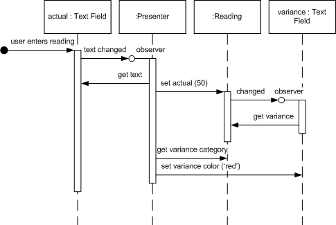

# Model View Presenter

> These notes are based on [Martin Fowler's GUI Architectures post](https://www.martinfowler.com/eaaDev/uiArchs.html) and [Potel paper](http://www.wildcrest.com/Potel/Portfolio/mvp.pdf). There's another interesting [paper](http://www.object-arts.com/papers/TwistingTheTriad.PDF) that I haven't consider yet from the developers of Dolphin Smalltalk.

- [Model View Presenter](#model-view-presenter)
  - [Overview](#overview)
  - [How It Works](#how-it-works)
  - [Supervising Controller](#supervising-controller)
  - [MVC Comparison](#mvc-comparison)

## Overview

MVP is an architecture that first appeared in IBM and more visibly at Taligent during the 1990's.

MVP treats the *view* as a *structure of widgets* which doesn't contain any behavior that describes how the widgets react to user interaction. The *active reaction to user acts* lives in a separate *presenter* object. The fundamental handlers for user gestures still exist in the widgets, but **these handlers merely pass control to the presenter**.

> Potel discusses this interaction primarily in terms of *actions on the model*, which it does by a system of *commands* and *selections*. There's a useful approach of *packaging* all the edits to the model in a command - this provides a good foundation for providing undo/redo behavior.

The *presenter* decides how to react to the *event*. As the presenter *updates the model*, the *view* is updated through the same *observer synchronization* approach that MVC uses.

> The presenter *listens* to *events* and is able to get values from the actual widgets. At this point, the presenter decides whether or not to update the domain object, which widgets may observe and update as well.

## How It Works

* User gestures are handed off by the widgets to a *supervising controller*.
* The presenter coordinates changes in a domain model.
* Different variants of MVP handle view updates differently (e.g., from *observer synchronization* to having the presenter handling all the view updates).

## Supervising Controller

One of the variations about MVP is **the degree to which the presenter controls the widgets in the view**. On one hand there is the case where *all* view logic is left in the view and the presenter doesn't get involved in deciding how to render the model. This style is the one implied by *Potel*.

The direction behind *Dolphin Smalltalk* was towards what Martin Fowler describes as *Supervising Controller*, where the view handles a good deal of the view logic that can be described declaratively and the presenter then comes in to handle more complex cases.

## MVC Comparison

* Potel implies that MVC controllers were *overall coordinators*, while MVP uses a *supervising controller* to manipulate the model

* **You can think of presenters as being like a loose form of MVC controllers without the initial handling of the user gesture**. Widgets hand off user gestures to the supervising controller but aren't separated into views and controllers.

