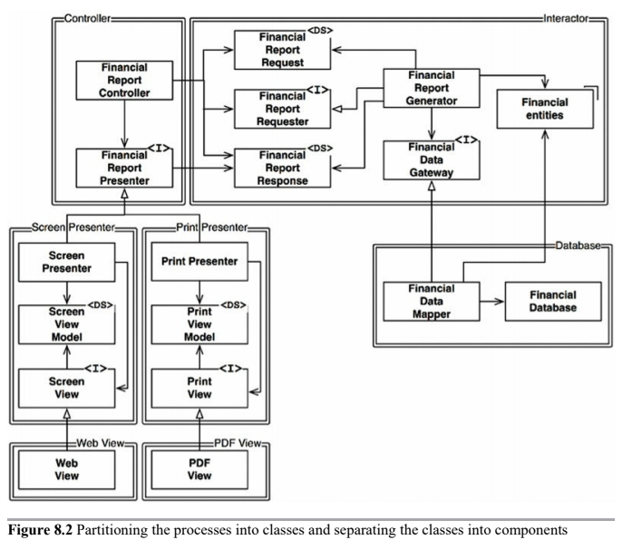
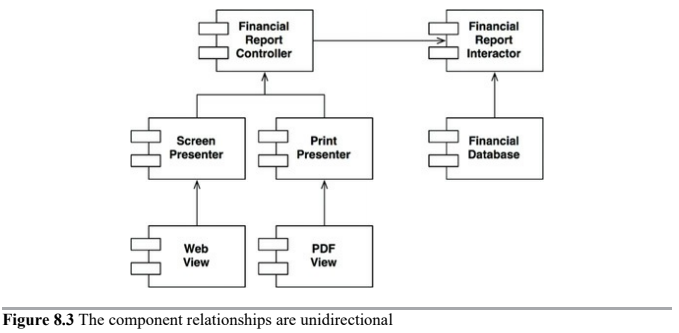

# Open-Closed Principle

> A software artifact should be __open for extension but closed for modification__. - Bertrand Mayer

The behavior of a software artifact ought to be extendible, without having to modify that artifact.

This is the most fundamental reason that we study software architecture. Clearly, if simply extensions to the requirements for massive changes to the software, then the architects of that software system have engaged in a failure.

## Thought Experiment

Imagine we have a system that displays a financial summary on a web page. The data on the page is scrollable, and negative numbers are rendered in red.

Now imagine that the stakeholders ask that this same information be turned into a report to be printed on a black-and-white printer. The report should be properly paginated, with appropriate page headers, page footers, and column labels. Negative numbers should be surrounded by parentheses.

Clearly, some new code must be written. But howe much old code will have to change?

A good software architecture would reduce the amount of changed code to the barest minimum. Ideally, zero.

How?

By properly separating the things that change for different reasons (_SRP_) and then organizing the dependencies between those things properly (_DIP_).

By applying the SRP, we might come up with the following data-flow. Some analysis procedure inspects the financial data and produces reportable data, which is then formatted appropriately by the two reporter processes.

The essential insight here is that generating the report involves two separate responsibilities:

* Calculation of the reported data
* Presentation of that data into a web- and printer-friendly form

__We need to organize the source code dependencies to ensure that changes to one of those responsibilities do not cause changes in the other__. Also, the new organization should ensure that the behavior can be extended without undo modification.

How?

__Partitioning the processes into classes, and separating those classes into components__. We'll have the following components: Controller, Database, Presenters and Views.

Classes marked with `<I>` are interfaces, those marked with `<DS>` are data structures. Open arrowheads are using relationships. Closed arrowheads are implements or inheritance relationships.

The first thing to notice is that all the dependencies are source code dependencies. An arrow pointing from class A to class B means that the source code of class A mentions the name of class B, but class B mentions nothing about class A.

The next thing to notice is that each double line is crossed in one direction only. This means that all __component relationships are unidirectional. These arrows point toward the components that we want to protect from change__.

__If component A should be protected from changes in component B, then component B should depend on component A__.

In our example, the Interactor is in the position that best conforms to the OCP. Changes to the Database, or the Controller, or the Presenters, or the Views, will have no impact on the Interactor.

Why should the Interactor hold such a privileged position? Because it __contains business rules, the highest-level policies of the application. All the other components are dealing with peripheral concerns__.

Even though the Controller is peripheral to the Interactor, it is nevertheless central to the Presenters and Views. This creates a hierarchy of protection based on the notion of "level".

This is how OCP works at the architectural level. Architects separate functionality based on how, why, and when it changes, and then organize that separated functionality into a hierarchy of components. __Higher-level components in that hierarchy are protected from changes made to lower-level components__.

## Directional Control

Much of the complexity in previous diagrams was intended to make sure that the dependencies between the components pointed in the correct direction.

For example, the FinancialDataGateway interface between the FinancialReportGenerator and the FinancialDataMapper exists to invert the dependency that would otherwise have pointed from the Interactor component to the Database component.

## Information Hiding

The FinancialReportRequester interface serves a different purpose. It is there to protect the FinancialReportController from knowing too much about the internals of the Interactor. If that interface were not there, then the Controller would have transitive dependencies on the FinancialEntities.

__Transitive dependencies are a violation of the general principle that software entities should not depend on things they don't directly use.__

Even though our first priority is to protect the Interactor from changes to the Controller, we also want to protect the Controller from changes to the Interactor by hiding the internals of the Interactor.

## Conclusion

The OCP is one of the driving forces behind the architecture of systems. We want to make systems easy to extend without incurring a high impact of change.

This goal is accomplished by partitioning the system into components, and arranging those components into a dependency hierarchy that protects higher-level components from changes in lower-level components.
