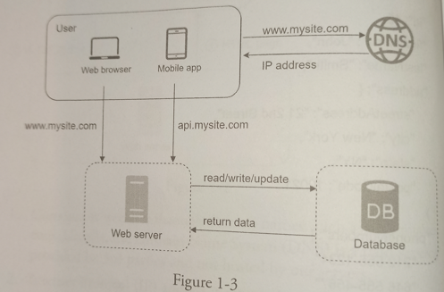

# Choosing a Database

* Overview
* Important Questions to Ask
* Relational
* Non-Relational

## Overview

The reason that we have many database options available today is due to the [CAP theorem](../databases/CAP).

> CAP Theorem: At any given time, you can only guarantee two of the following: consistency, availability, and partition tolerance. 

## Importat Questions to Ask

* How many relationships are in your data?
* What is the level of complexity in your data?
* How often do the data change?
* How often does your application query the data?
* How often does your application query the relationship underlying the data?
* How often do your users update the data?
* How often do your users update the logic in the data?
* How critical is your Application in a disaster scenario?

## Relational

> Examples: SQL Server, MySQL, Oracle database, PostgresSQL, IBM DB2.

Relational databases traditionally feature **strong consistency** and **high availability** at the expense of partition tolerance.

* Advantages
  * Optimized for writes
  * Simplicity
  * Ease of data retrieval
  * Data integrity
  * Flexibility

* Disadvantages
  * Costly
  * Structured limits (i.e, field lengths)
  * Isolation

## Non-relational

> Examples: Memcached, Redis, Coherence, HBase, BigTable, Accumulo, MongoDB, CouchDB.

Non-relational databases have been developed to serve **availability** and **partition tolerance** needs mostly. Great for data that's unstructured or not relational at all, or for only serializing/deserializing data (JSON, XML, YAML, etc).

* Advantages
  * Super-low latency
  * Handles massive amount of data
  * Flexibility (store structured, semi-structured, and unstructured data)
  * Agile Programming (ease of evolving on iterations)
  * Inexpensive scalability (efficiently scale out)

* Disadvantages
  * Do not perform ACID transactions
  * Rely on "eventual consistency"
  * Lacks standardization
  * Not all non-relational databases are good at automating the process of sharding, or spreading the database across multiple nodes.
