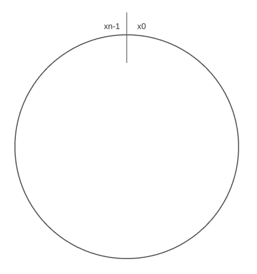

# Consistent Hashing

* Overview
* Hash space and hash ring
* Hash servers

## Overview

*Consistent hashing* is a special kind of hashing such that when a hash table is re-sized, only `k/n` keys need to be remapped to on average, where `k` is the number of keys, and `n` is the number of slots. In constrast, in most traditional hash tables, a change in the number of array slots causes nearly all keys to be remapped.

## Hash space and hash ring

Assume SHA-1 is used as the hash function $f$, and the output range of the hash function is: $x_0$, $x_1$, $x_2$, ..., $x_{n-1}$. In cryptography, SHA-1's hash space goes from 0 to $2^160 - 1$. That means $x_0$ corresponds to 0, $x_{n-1}$ corresponds to $2^160 - 1$, and all the other hash values in the middle fall between 0 and $2^160 - 1$.

